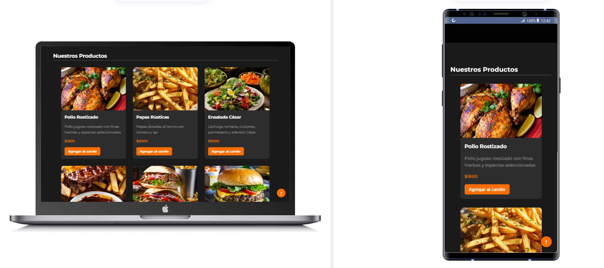
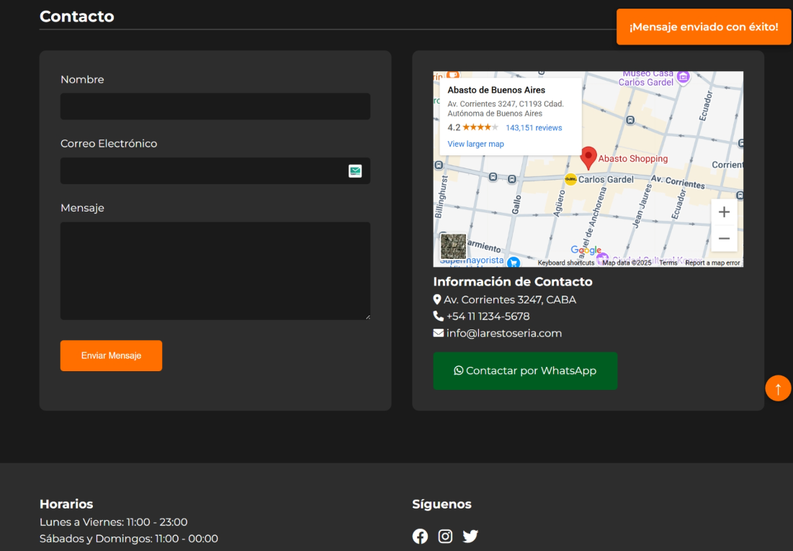
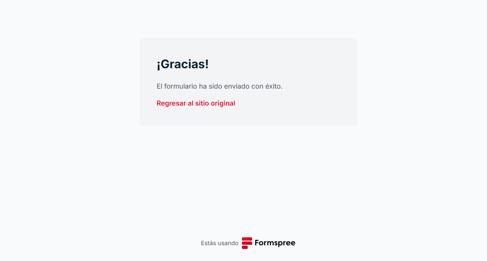

# 🍽️ Restaurante Web - Pre-entrega

## 📝 Descripción del Proyecto
Este proyecto es una pre-entrega para el curso de Full Stack con Node.js de Talento Tech. Consiste en una página web responsive para un restaurante, desarrollada con HTML y CSS, con planes futuros de implementación de JavaScript para funcionalidades interactivas.

## 🚀 Características Actuales
- Diseño completamente responsive
- Sección de productos con catálogo de platillos
- Formulario de contacto funcional
- Mapa de ubicación integrado
- Navegación intuitiva

## 🔮 Próximas Implementaciones
- Carrito de compras con JavaScript
- Animaciones interactivas
- Sistema de reservas
- Panel de administración

## 🛠️ Tecnologías Utilizadas
- HTML5
- CSS3
- Formspree (para el formulario de contacto)
- Google Maps Embed API

## 📸 Capturas de Pantalla

### Página Principal
  
<!--URL:  
-->

### Sección de Productos Desktop y Móvil 
  
<!--URL:  
-->

### Formulario de Contacto
  
  

<!--URL:  
  
-->


## 🎯 Objetivos del Proyecto
1. Demostrar habilidades en maquetación HTML y CSS
2. Crear una interfaz de usuario intuitiva y atractiva
3. Implementar diseño responsive para todos los dispositivos
4. Sentar las bases para futuras funcionalidades con JavaScript

## 💻 Instalación y Uso
1. Clona este repositorio
```bash
git clone [URL del repositorio]# proyecto-final-Ecommerce-MarcoCor
